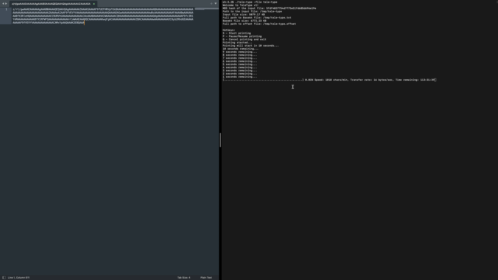

# TeleType

**TeleType** is a tool that allows you to remotely transfer any binary file by simulating keyboard input. The file is converted into a Base64-encoded string and "typed" as UTF-8 characters. This can be useful for transferring files across systems where file transfer capabilities are restricted, but keyboard input is allowed.

## Features

- Converts any binary file into a Base64-encoded text.
- Simulates typing of the Base64 string via keyboard input.
- Provides progress tracking with speed and estimated time remaining.
- Supports pausing, resuming, and canceling the typing process.
- Automatically saves and loads the typing progress from an offset file.
- **Average typing speed**: 1000 characters per minute.
- **Average data transfer rate**: 16 bytes per second.

## Requirements

- Go 1.22.5 or higher
- The following Go libraries:
  - `github.com/eiannone/keyboard`
  - `github.com/go-vgo/robotgo`

## Installation

1. Clone the repository:

   ```bash
   git clone https://github.com/your-username/TeleType.git
   cd TeleType
   ```

2. Install the required Go packages:

   ```bash
   go get github.com/eiannone/keyboard
   go get github.com/go-vgo/robotgo
   ```

3. Build the program:

   ```bash
   go build
   ```

## Usage

1. Run the program, specifying the binary file to transfer:

   ```bash
   ./tele-type -file <path to your binary file>
   ```

2. Follow the on-screen instructions to control the process with hotkeys.

### Hotkeys:

- **S**: Start printing the Base64-encoded text.
- **P**: Pause/Resume the printing process.
- **Q**: Cancel printing and exit the program.

### Example:

```bash
./tele-type -file ./example.bin
```

## Preview

### Video Demonstration

[](./TeleType.mp4)

## How It Works

1. **Base64 Encoding**: The input binary file is encoded into a Base64 string and saved as a `.txt` file in the same directory as the input file.

2. **Typing Simulation**: Using the `robotgo` library, TeleType simulates key presses to "type" the Base64 string. Special characters like `+`, `/`, and `=` are handled accordingly.

3. **Offset Management**: The program tracks the current position in the Base64 string using an offset file, allowing the process to resume from where it left off if interrupted.

4. **Progress Tracking**: A progress bar is displayed, showing the current percentage of the file typed, speed (in characters per minute), transfer rate (in bytes per second), and estimated time remaining.

## Hotkey Controls

While running the program, the following hotkeys are available:

- **S**: Start the process of typing the Base64 string.
- **P**: Pause or resume typing. This allows you to halt the process and continue at a later time without losing progress.
- **Q**: Cancel the typing process and exit the program. This will also delete the generated Base64 and offset files.

## File Structure

- `main.go`: Main program logic.
- `<file>.txt`: Base64-encoded version of the input file.
- `<file>.offset`: Stores the current progress in the typing process.

## Performance

- **Average typing speed**: 1000 characters per minute.
- **Average data transfer rate**: 16 bytes per second.

## Limitations

- The program relies on keyboard input simulation, so it should be run in an environment where the remote system can accept keyboard input. Make sure no other tasks interfere with the typing process while the program is running.

## License

This project is licensed under the MIT License.